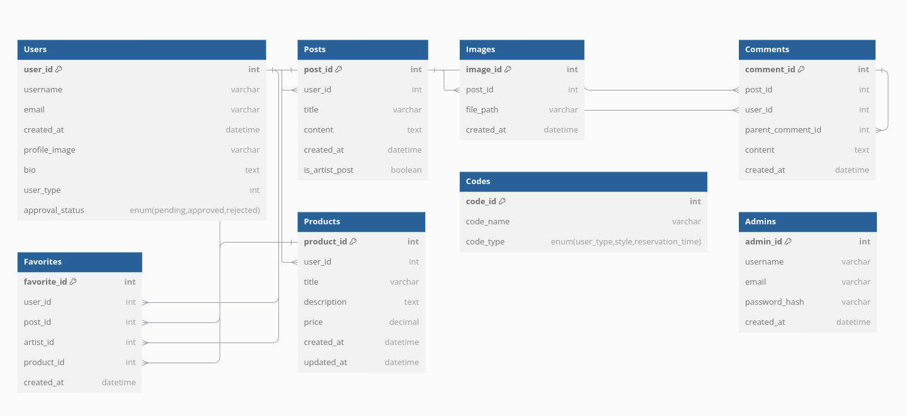
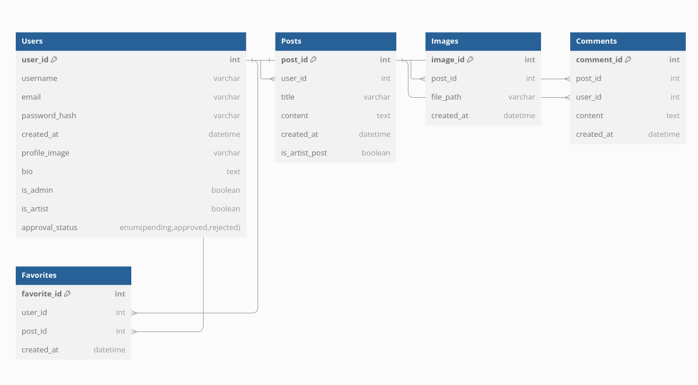

# 디어모먼트 백엔드 업무분장표

## 업무 분장표

| **담당자** | **주요 업무**                                | **상세 내용**                                                                                       |
|------------|---------------------------------------------|----------------------------------------------------------------------------------------------------|
| **성민**   | 이미지 관련 기능 및 게시글 작성/관리          | - 유저가 업로드한 이미지 처리 및 저장 - 이미지 최적화 및 썸네일 생성 - 게시글 작성 및 관리 기능 개발 |
| **병욱**   | 회원가입 및 사용자 관리                      | - 유저 회원가입 및 로그인 - 사용자 정보 수정 - 비밀번호 암호화 및 인증 기능 구현              |
| **호준**   | 백오피스, 작가 관리, 댓글 및 찜 기능 개발      | - 백오피스 기능 개발 (관리자용 대시보드, 작가 및 유저 관리) - 댓글 및 찜 기능 구현 및 성민과 협업  |
| **공통**   | API 개발 및 문서화                           | - RESTful API 개발 및 유지보수 - API 문서화 및 외부 연동 지원 - 공통 응답 형식 표준화        |
| **공통**   | 데이터베이스 관리 및 최적화                  | - 데이터베이스 스키마 설계 및 관리 - 성능 최적화를 위한 인덱스 설정 및 쿼리 튜닝 - 데이터 백업 및 복구 |

---

## 업무 분장 세부 설명

### 1. 성민 (이미지 및 게시글 관련)
- **이미지 관련**: 게시글 작성 시 업로드되는 이미지 처리 및 저장 담당.
- **게시글 관련**: 게시글 작성 및 수정/삭제와 관련된 전체적인 기능 구현.

### 2. 병욱 (회원가입 및 사용자 관리)
- 회원 가입, 로그인, 사용자 정보 수정 등 사용자 인증 및 관리 담당.
- JWT 또는 OAuth2 기반 인증 방식 구현 및 테스트.

### 3. 호준 (백오피스, 작가, 댓글 및 찜 기능 관련)
- **백오피스**: 관리자 대시보드, 유저 관리, 작가 및 유저 프로필 관리 기능 구현.
- **댓글 기능**: 게시글과 연계된 댓글 작성, 수정, 삭제, 신고 등의 기능 개발 및 성민과 협업.
- **찜 기능**: 사용자의 찜 기능 구현 및 관리, 성민과 협업.
- **관리자 승인 기능**: 관리자가 유저를 작가로 승인하거나 관리자로 승격하는 기능 구현.

### 4. 공통 (API 개발 및 문서화)
- RESTful API 설계 및 구현.
- Swagger 또는 Postman을 활용한 API 문서화.
- 공통 에러 응답 및 상태 코드 관리.

### 5. 공통 (데이터베이스 관리 및 최적화)
- 효율적인 데이터 저장 및 검색을 위한 스키마 설계.
- 성능 저하 방지를 위한 정기적인 쿼리 최적화.
- 데이터베이스 백업 및 복구 프로세스 준비.

---

## 예상 API 엔드포인트 갯수

### 1. 이미지 관련 기능 (성민)
- **POST /api/images**: 이미지 업로드
- **GET /api/images/{id}**: 이미지 조회
- **DELETE /api/images/{id}**: 이미지 삭제

**예상 API 개수**: 3개

### 2. 회원가입 및 사용자 관리 (병욱)
- **POST /api/users/signup**: 회원가입
- **POST /api/users/login**: 로그인
- **GET /api/users/{id}**: 사용자 정보 조회
- **PATCH /api/users/{id}**: 사용자 정보 수정
- **POST /api/users/logout**: 로그아웃

**예상 API 개수**: 5개

### 3. 게시글 작성 및 관리 (성민)
- **POST /api/posts**: 게시글 작성
- **GET /api/posts**: 게시글 목록 조회
- **GET /api/posts/{id}**: 게시글 상세 조회
- **PATCH /api/posts/{id}**: 게시글 수정
- **DELETE /api/posts/{id}**: 게시글 삭제

**예상 API 개수**: 5개

### 4. 댓글 기능 (호준)
- **POST /api/comments**: 댓글 작성
- **GET /api/comments/{postId}**: 댓글 조회
- **PATCH /api/comments/{id}**: 댓글 수정
- **DELETE /api/comments/{id}**: 댓글 삭제

**예상 API 개수**: 4개

### 5. 찜 기능 (호준)
- **POST /api/favorites**: 찜하기 추가
- **GET /api/favorites**: 찜한 목록 조회
- **DELETE /api/favorites/{id}**: 찜하기 삭제

**예상 API 개수**: 3개

### 6. 작가 관리 기능 (호준)
- **PATCH /api/users/{id}/approve-artist**: 유저를 작가로 승인
- **GET /api/users/artists**: 작가 목록 조회
- **GET /api/users/{id}/profile**: 유저/작가 프로필 조회

**예상 API 개수**: 3개

### 7. 백오피스 기능 (호준)
- **GET /api/admin/users**: 사용자 목록 조회
- **PATCH /api/admin/users/{id}**: 사용자 권한 변경 (관리자 승격 및 작가 승인)
- **GET /api/admin/stats**: 통계 데이터 조회
- **PATCH /api/admin/settings**: 시스템 설정 변경

**예상 API 개수**: 4개

---

### **총 예상 API 개수**: 27개

---

## 데이터베이스 상세 설명

### 1. Users 테이블
- **user_id** (PK): 사용자의 고유 ID.
- **username**: 사용자의 이름.
- **email**: 사용자의 이메일 주소.
- **password_hash**: 암호화된 비밀번호.
- **created_at**: 계정 생성 일자.
- **profile_image**: 유저/작가 프로필 이미지 경로.
- **bio**: 유저/작가 소개.
- **is_admin**: 관리자인지 여부 (Boolean).
- **is_artist**: 작가인지 여부 (Boolean).
- **approval_status**: 작가 승인 상태 (`pending`, `approved`, `rejected`).

### 2. Posts 테이블
- **post_id** (PK): 게시글의 고유 ID.
- **user_id** (FK): 게시글을 작성한 사용자 ID.
- **title**: 게시글 제목.
- **content**: 게시글 내용.
- **created_at**: 게시글 작성 일자.
- **is_artist_post**: 작가가 작성한 게시글 여부 (Boolean).

### 3. Images 테이블
- **image_id** (PK): 이미지의 고유 ID.
- **post_id** (FK): 이미지를 포함한 게시글 ID.
- **file_path**: 이미지 파일 경로.
- **created_at**: 이미지 업로드 일자.

### 4. Comments 테이블
- **comment_id** (PK): 댓글의 고유 ID.
- **post_id** (FK): 댓글이 달린 게시글 ID.
- **user_id** (FK): 댓글을 작성한 사용자 ID.
- **content**: 댓글 내용.
- **created_at**: 댓글 작성 일자.

### 5. Favorites 테이블
- **favorite_id** (PK): 찜하기의 고유 ID.
- **user_id** (FK): 찜한 사용자 ID.
- **post_id** (FK): 찜한 게시글 ID.
- **created_at**: 찜한 일자.

