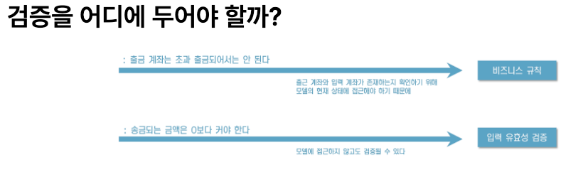
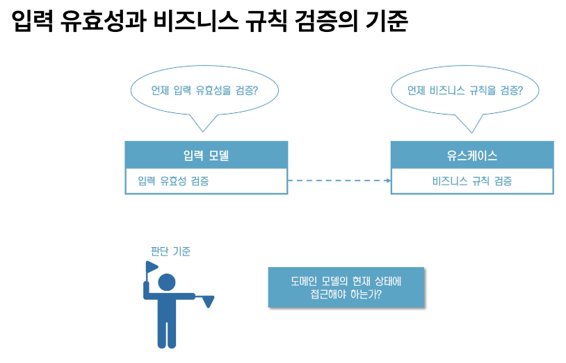

# 디어모먼트 백엔드 업무분장표

## 🗂️ 업무 분장표

| **담당자** | **주요 업무**                                | **상세 내용**                                                                                       |
|------------|---------------------------------------------|----------------------------------------------------------------------------------------------------|
| **성민**   | 🖼️ 이미지 관련 기능 및 게시글 작성/관리          | - 유저가 업로드한 이미지 처리 및 저장<br>- 이미지 최적화 및 썸네일 생성<br>- 게시글 작성 및 관리 기능 개발<br>- 댓글 및 대댓글 기능 구현 |
| **병욱**   | 🧑‍💻 회원가입 및 사용자/작가 관리                 | - 유저 회원가입 및 로그인<br>- 사용자 정보 수정<br>- OAuth 기반 인증 기능 구현<br>- 작가 및 유저 프로필 관리 |
| **호준**   | 🛠️ 백오피스, 상품 관리, 찜 기능, 코드 관리 개발 | - 백오피스 기능 개발 (관리자용 대시보드)<br>- 작가별 상품 등록, 수정, 삭제 관리<br>- 찜 기능 구현 및 성민과 협업<br>- 코드 관리 (유저 유형 코드 포함) |
| **공통**   | 🌐 API 개발 및 문서화                           | - RESTful API 개발 및 유지보수<br>- API 문서화 및 외부 연동 지원<br>- 공통 응답 형식 표준화        |

---

### 주요 클래스 및 역할
- application.port.in
    - 애플리케이션의 유스케이스를 정의하는 인터페이스입니다.
    - 예: CreateOrderUseCase, GetOrderDetailsUseCase 등. 
  
- application.port.out
  - 도메인 로직이 외부 시스템과 상호작용해야 할 때 사용하는 인터페이스입니다.
  - 예: OrderRepository, PaymentGatewayPort 등.

- application.service
  - 포트(인터페이스)를 구현하는 서비스 클래스입니다.
  - 비즈니스 로직을 처리하며, 도메인 객체와 상호작용합니다.

- domain
  - 핵심 도메인 로직과 엔티티를 포함합니다.
  - 모든 비즈니스 규칙은 이 계층에 정의됩니다.
  - 예: Order, Customer, OrderStatus 등.

- adapter.in
  - 사용자 인터페이스 계층입니다.
  - REST API, 메시지 큐 리스너 등 외부에서 애플리케이션으로 들어오는 요청을 처리합니다.

- adapter.out
  - 외부 시스템과의 상호작용을 담당합니다.
  - 예: 데이터베이스, 외부 API, 파일 시스템 등과의 연동.

### 유효성 검증
- 입력 데이터 검증 (adapter.in):
  - HTTP 요청 또는 메시지 큐로부터 들어오는 데이터를 검증합니다.
  - 예: @RequestBody 객체의 필드 유효성 검사.
  - 기술: javax.validation 또는 Spring Validation.

- 도메인 로직 검증 (domain):
  - 도메인 규칙을 위반하는 데이터는 생성되지 않도록 합니다.
  - 예: 엔티티 생성 시, 값이 유효하지 않으면 ValidationException 발생.
  - 기술: 생성자 또는 정적 팩토리 메서드.

- 외부 의존성 검증 (adapter.out):
  - 외부 시스템으로부터 받은 데이터를 검증합니다.
  - 예: 외부 API의 응답 데이터 유효성 확인.

- 이외 참고 자료 (만들면서 배우는 클린 아키텍처 책 발췌)
  
  

### 의존성 방향
- 의존성은 항상 Core 방향으로 흘러가야 합니다.
- 어댑터 → 포트 → Core의 방향을 유지하여 Core가 어댑터나 외부 시스템에 의존하지 않도록 해야 합니다.

## 참고자료
- [주니어 개발자의 백엔드 아키텍처 개선 도전기](https://techblog.uplus.co.kr/%EC%A3%BC%EB%8B%88%EC%96%B4-%EA%B0%9C%EB%B0%9C%EC%9E%90%EC%9D%98-%EB%B0%B1%EC%97%94%EB%93%9C-%EC%95%84%ED%82%A4%ED%85%8D%EC%B2%98-%EA%B0%9C%EC%84%A0-%EB%8F%84%EC%A0%84%EA%B8%B0-9fb19982db9c)
- [만들면서 배우는 클린 아키텍처 책 예제 소스 깃](https://github.com/wikibook/clean-architecture)
- [hexagonal architecture?](https://medium.com/@hello-every-one/hexagonal-architecture-3729e9a9200b)

# 제품 등록 및 업데이트 API 문서

이 문서는 프론트엔드에서 제품 등록 및 업데이트 API를 호출할 때,
정렬, 삭제, 재정렬, 교체 등 다양한 엣지 케이스를 어떻게 처리할 수 있는지 자세하게 설명합니다.  
JSON Payload와 Multipart 파일을 이용한 요청 예시와 함께 각 단계의 흐름을 상세히 기술하였으니,  
복사하여 참고하시기 바랍니다.

---

## 1. 제품 등록 (Product Registration)

### 1.1. API 개요

- **목적**: 새로운 제품을 등록한다.
- **요청 방식**: JSON Payload와 Multipart 파일을 동시에 전송  
  (JSON에는 제품 기본 정보 및 옵션을 포함하며, Multipart 파일에는 신규 이미지 파일들이 첨부된다.)

### 1.2. JSON Payload 예시

```json
{
  "userId": 456,
  "title": "새로운 제품",
  "description": "최신 기능이 적용된 제품입니다.",
  "price": 19999,
  "typeCode": 0,
  "concept": "ELEGANT",
  "originalProvideType": "FULL",
  "partialOriginalCount": null,
  "shootingTime": "2023-08-01T10:00:00",
  "shootingLocation": "서울",
  "numberOfCostumes": 3,
  "seasonYear": 2023,
  "seasonHalf": "FIRST_HALF",
  "partnerShops": [
    {
      "name": "PartnerShop A",
      "link": "https://partnershopA.com"
    }
  ],
  "detailedInfo": "제품에 대한 자세한 설명",
  "warrantyInfo": "1년 무상 보증",
  "contactInfo": "010-1234-5678",
  "options": [
    {
      "optionId": null,
      "name": "추가 보증 연장",
      "additionalPrice": 5000,
      "description": "보증기간 1년 연장"
    }
  ],
  "images": []
}
```

### 1.3. Multipart Files
- 신규 이미지 파일들을 개별 multipart 파트로 첨부합니다.
- 예: `image1.jpg`, `image2.jpg`, … (최소 10개 이상의 파일 첨부 가능)
- 백엔드에서는 각 이미지 파일이 업로드되고, 고유한 `fileName`(예: `nanoid`로 생성된 값)과 `URL`이 내부적으로 저장됩니다.

---

## 2. 제품 업데이트 (Product Update)

### 2.1. API 개요

- **목적**: 기존 제품의 정보를 수정하고, 이미지 및 옵션을 추가, 삭제, 재정렬한다.
- **요청 방식**: JSON Payload와 Multipart 파일을 동시에 전송  
  (JSON에는 제품의 수정된 정보, 옵션, 그리고 이미지 식별 정보를 포함하며, Multipart 파일에는 신규 이미지 파일들이 첨부된다.)

### 2.2. 이미지 관련 DTO - ImageReference

프론트엔드에서는 이미지 업데이트 시, 이미지 식별 정보를 단순 문자열 대신 전용 값 객체(`ImageReference`)로 전달할 수 있습니다.

```json
{
  "identifier": "existingImage123"
}
```

- 예시: 기존 이미지의 고유 `fileName` 또는 신규 이미지의 플레이스홀더 값
  - 기존 이미지: `"existingImage123"`
  - 신규 이미지 플레이스홀더: `"new_0"`, `"new_1"`, 등

---

### 2.3. JSON Payload 예시 (제품 업데이트)

#### 2.3.1. 사례 1: 기존 이미지 유지 + 신규 이미지 추가 + 이미지 순서 변경

```json
{
  "productId": 123,
  "userId": 456,
  "title": "업데이트된 제품 제목",
  "description": "제품 설명이 업데이트되었습니다.",
  "price": 15000,
  "typeCode": 0,
  "concept": "MODERN",
  "originalProvideType": "FULL",
  "partialOriginalCount": null,
  "shootingTime": "2023-08-05T14:00:00",
  "shootingLocation": "부산",
  "numberOfCostumes": 2,
  "seasonYear": 2023,
  "seasonHalf": "SECOND_HALF",
  "partnerShops": [
    {
      "name": "PartnerShop A",
      "link": "https://partnershopA.com"
    }
  ],
  "detailedInfo": "업데이트된 상세 정보",
  "warrantyInfo": "2년 보증",
  "contactInfo": "010-9876-5432",
  "options": [
    {
      "optionId": 789,
      "name": "기존 옵션 업데이트",
      "additionalPrice": 1500,
      "description": "옵션 설명 수정"
    },
    {
      "optionId": null,
      "name": "신규 옵션 추가",
      "additionalPrice": 2000,
      "description": "신규 옵션 설명"
    }
  ],
  "images": [
    "existingImage123", "new_0", "existingImage456", "new_1",
    "existingImage789", "existingImage321", "existingImage654",
    "existingImage987", "existingImage741", "existingImage852"
  ]
}
```

#### 2.3.2. 사례 2: 모든 기존 이미지 삭제 후 신규 이미지만 추가

```json
{
  "productId": 123,
  "userId": 456,
  "title": "업데이트된 제품 제목 - 이미지 전환",
  "description": "기존 이미지를 모두 삭제하고 신규 이미지만 추가합니다.",
  "price": 15000,
  "typeCode": 0,
  "concept": "MODERN",
  "originalProvideType": "FULL",
  "partialOriginalCount": null,
  "shootingTime": "2023-08-05T14:00:00",
  "shootingLocation": "부산",
  "numberOfCostumes": 2,
  "seasonYear": 2023,
  "seasonHalf": "SECOND_HALF",
  "partnerShops": [],
  "detailedInfo": "",
  "warrantyInfo": "",
  "contactInfo": "",
  "options": [],
  "images": [
    "new_0", "new_1", "new_2", "new_3", "new_4",
    "new_5", "new_6", "new_7", "new_8", "new_9"
  ]
}
```

---

이 문서는 제품 등록 및 업데이트 시 JSON과 Multipart 요청을 구성하는 방법을 설명하며,  
특히 이미지 관련 다양한 엣지 케이스(삭제, 순서 변경, 추가, 재정렬 등)를 처리하는 방식을 다룹니다.